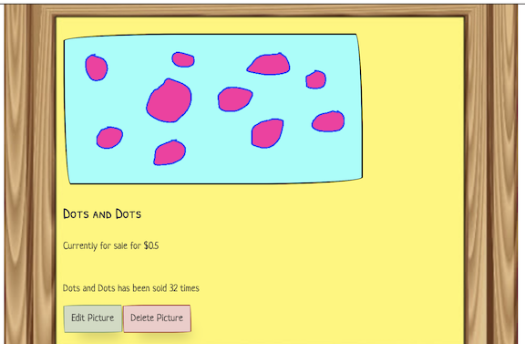
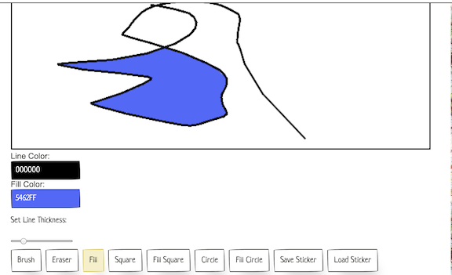
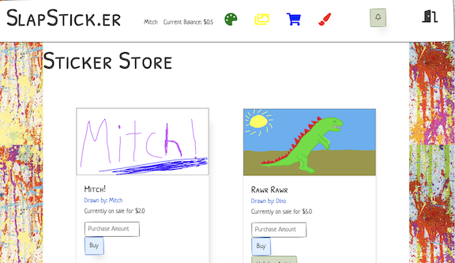

# SlapSticker Project

## Project Description
Hello, and welcome to my app. This is SlapStick.er, a single page app made mostly in javascript. The idea behind the page, is to make a site where users can draw their own stickers, then buy and sell drawn stickers with other users. I decided to make this page as practice for javascript and front-end web design in general. As this is something focused on the front-end, I decided to make something artsy!

## Technologies Used
* JavaScript
* Ruby on Rails
* Paper.css
* Jscolor

## Installation
* First, clone the repo to your machine
* Then navigate to the repo in your terminal, and then to the folder called  `slap-sticker-backend`
* Run `bundle install` to get any gems, then run  `rails s`
* Then navigate up to the root directory, then down into  `slap-sticker-frontend`
* Finally run  `open index.html`

## Schema
The model relationships for this project are pretty simple. An image belongs to the user that drew it. Users also have many other images through purchases.

## User Stories
* A user can log in (through a very simple login)
* A user can draw a new image and save and load their image at any time
* A user can see in their gallery all the images they've drawn and then open them back up in the canvas
* A user can mark an image as for sale and put it up in the store with a price they set
* A user can buy other stickers, and look at their collection
* A user can follow another user, and get updates when they put a new sticker up for sale

## Walkthrough of Page Functionality

When you load up the page, you will first be met with a login screen. This is a really basic login, so you just need to put in a username. If a user with that name exists in the database, you will gain access to their profile. If not, you will create a new instance and use that. Then it will automatically take you to the gallery page. If the account has any images, they will show up here. Attatched to them are text descriptions, and links to eidt or delete them. The delete button does what it says it does, and the edit button loads up the canvas with that image already attached. 

At the top of the page is the header. There are buttons with links to the gallery, store page, and sticker collection of the user. There is also a button to logout and return to the login screen, and a button to start up a new image. This will take you to the canvas with no image loaded.

The canvas has buttons below to change the tools and save and load the image. You can freely draw on the canvas with different colors and tools. When you hit save, it will save the current state of the canvas to the database. When you click the load button, it will return the canvas to the last saved state of the image. Once the image has been saved once it will be visable on the gallery. From the canvas page, you can also edit your image, adding a title and price to the sticker. Finally, you can click a button to toggle wether the image is for sale or not.

If you go to the store page, you will see the stickers up for sale by every user. You can buy stickers in different quantities and it will update both your own and the sellers balance. You can follow another artist in order to get updates when they add a new sticker. Whenever someone buys a sticker, follows an artist, or an artist you follow puts a new sticker up for sale a live notification goes to the related user. If you go an look at your stickers page you will see all the stickers you've purchased.

## Challenges Faced

I didnt have any experience with canvas before starting this project. It presented many challenges. I had to brush off my old geometry knowledge for line drawing and finding the right pixel location. When it came to saving the image to the database, I had to find a good way to do so without taxing the user's computer, as the information attached to a custom image can be very large, at it turns out. 

Of particular note, building the fill function to work was a pretty big challenge. It took me on a journey down the algorithm rabbit hole that I wasnt quite expecting. Eventually I properly implemented the right algorithm that theoretically worked the most efficiently by checking for all the pixels that needed to be filled in, without checking the same pixel twice, however it was still to intensive for a smooth experience. I eventually got it working by employing a 32 bit array to help manage the data to make it workable and really smooth for the user. Overall I'm really proud of how it turned out. 